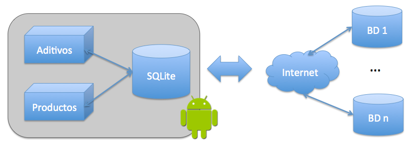
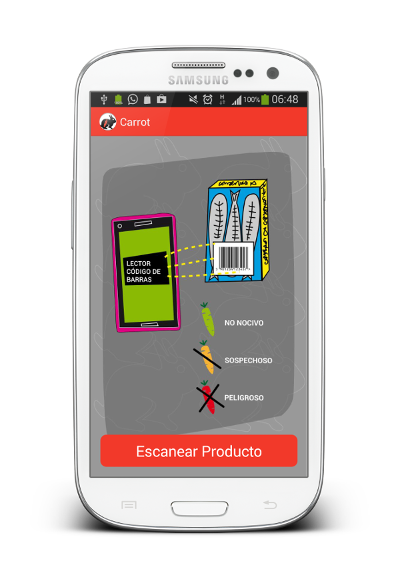

Carrot
======

Componentes del Equipo
---------------------

* Pedro Mármol Pérez (Contenidos)
* Liles Hernández (Diseñadora)
* Juanjo Vega Gea (Desarrollador)
* José Juan Sánchez Hernández (Desarrolador)

Descripción
-------------
### ¿Qué es?
Una original aplicación para **comprobar** los **componentes químicos** de los alimentos.

### Dirigida a
Consumidores interesados en el **grado de peligrosidad** de los adi9vos, conservantes, colorantes, edulcorantes,...

Fuentes de datos utilizadas:
* [E-Aditivos](http://www.e-aditivos.com). Lista de aditivos nocivos en los alimentos.
* [Ecocosas](http://ecocosas.com/salud-natural/conservantes-colorantes-aditivos-edulcorantes/). Listado de conservantes, colorantes, aditivos y edulcorantes.

Estado del desarrollo actual
----------------------------

Es un prototipo funcional.

### Aditivos
* BD actual con: 257 aditivos
* Fuente: [http://www.e-aditivos.com](http://www.e-aditivos.com).
* Obtenida con Web Scrapping.

### Trabajo Futuro
* Extender el uso para conocer el origen vegetal o animal de de los alimentos.
* Mostrar información adicional de los productos consultados.
* Incorporar nuevas fuentes de datos de aditivos y productos.

  

Especificaciones Técnicas
--------------------------
* Android.
* SQLite.
* Barcode Scanner.
* Web Scraper en PHP.

Screenshots
-----------

  

  

  

Licencia
---------
